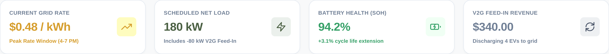
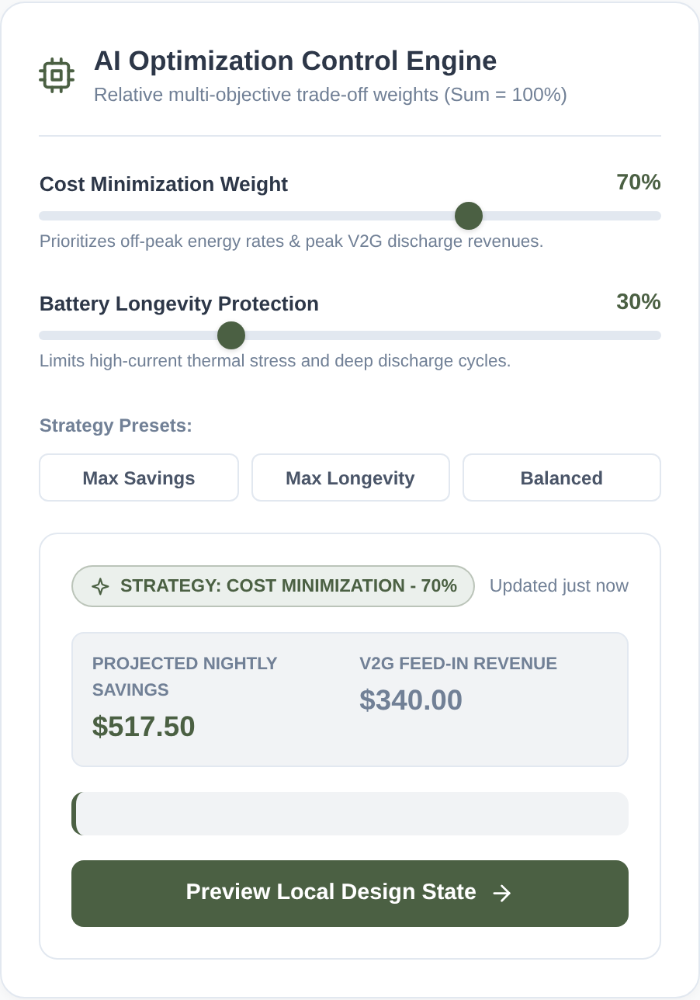
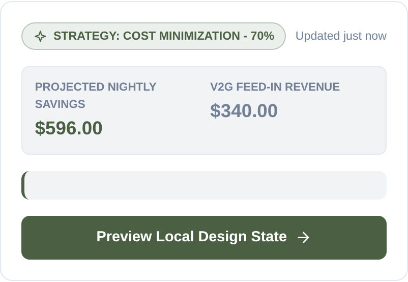
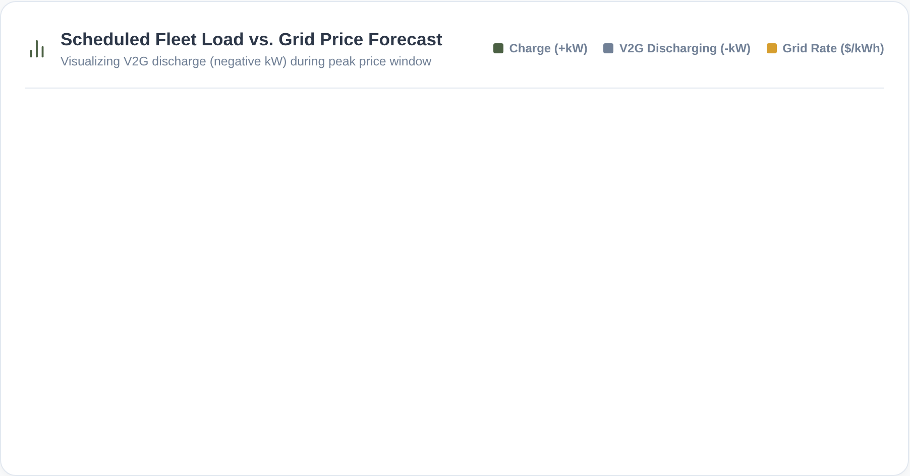
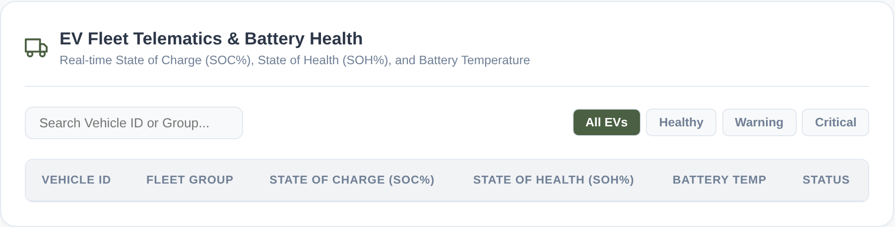
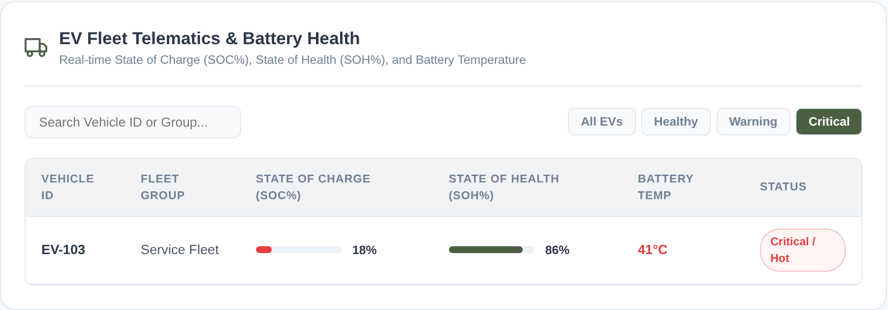
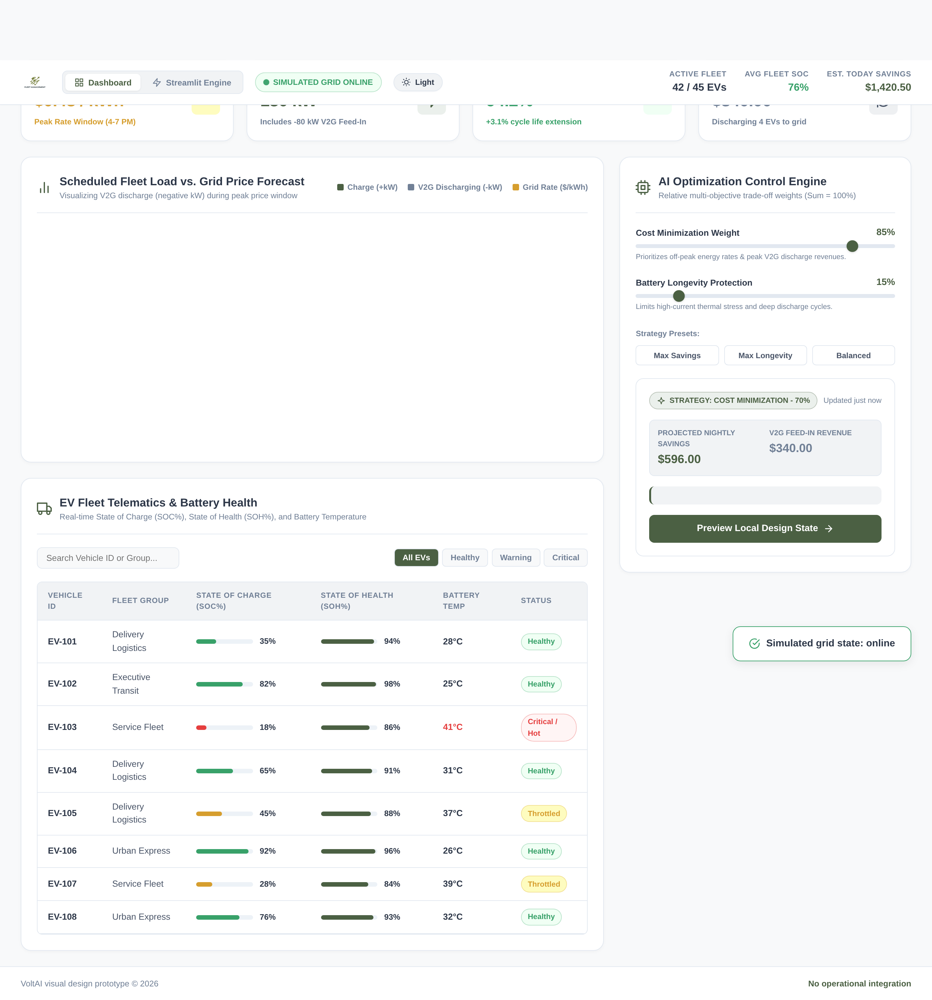
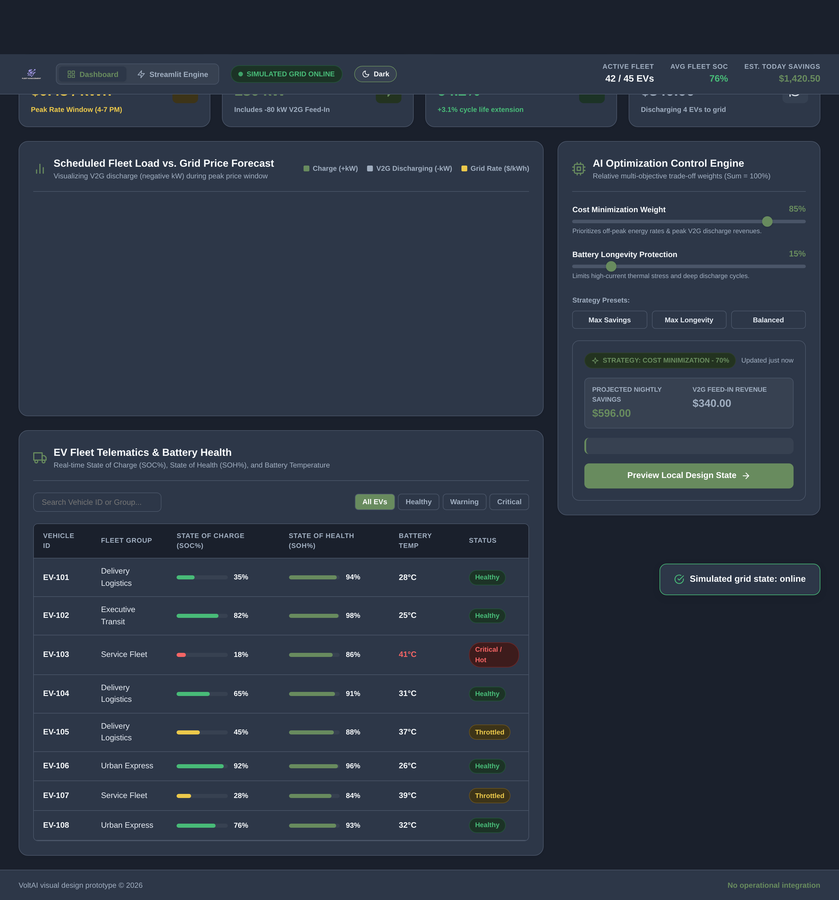
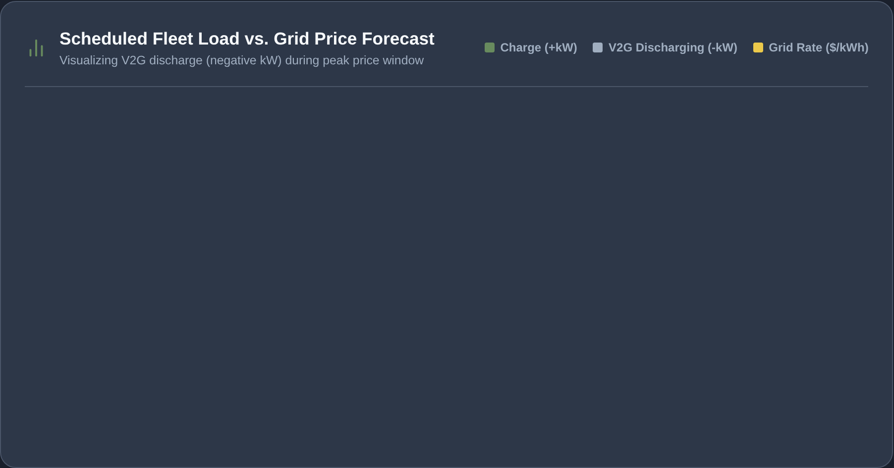
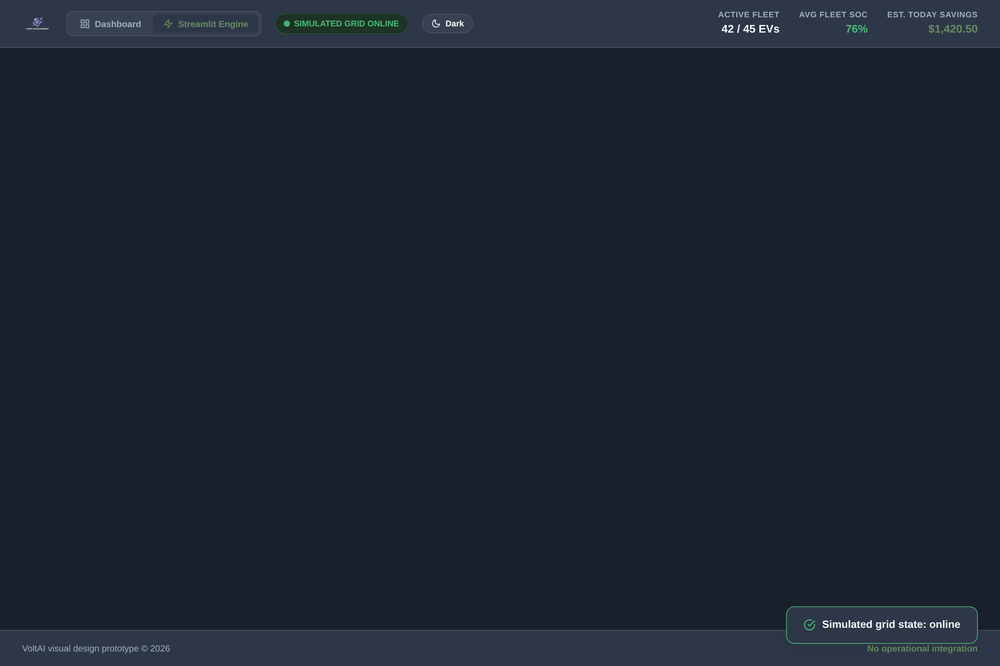

# VoltAI — Complete Feature Tutorial & Operator Guide

Welcome to the **VoltAI Operations & Feature Tutorial**. This guide provides an end-to-end walkthrough of every feature, widget, metric, chart, and optimization control in VoltAI.

All visual assets and interactive states documented here were generated and captured automatically using **Playwright**.

---

## Table of Contents

1. [Executive Overview & Brand Header](#1-executive-overview--brand-header)
2. [Key Performance Indicator (KPI) Metric Cards](#2-key-performance-indicator-kpi-metric-cards)
3. [AI Optimization Control Engine & Priority Sliders](#3-ai-optimization-control-engine--priority-sliders)
4. [AI Action Center & Strategy Presets](#4-ai-action-center--strategy-presets)
5. [Dual-Axis Charging Load vs. Grid Price Chart](#5-dual-axis-charging-load-vs-grid-price-chart)
6. [EV Fleet Telematics & Battery Health Monitoring](#6-ev-fleet-telematics--battery-health-monitoring)
7. [Simulated Microgrid & Islanding Mode](#7-simulated-microgrid--islanding-mode)
8. [Dual-Theme System (Light & Dark Modes)](#8-dual-theme-system-light--dark-modes)
9. [Streamlit Optimization Engine & Independent Checker Gate](#9-streamlit-optimization-engine--independent-checker-gate)
10. [Grounded Multi-Agent Operations Copilot (LangGraph)](#10-grounded-multi-agent-operations-copilot-langgraph)
11. [Human Operator Approval Workflow & Audit Trail](#11-human-operator-approval-workflow--audit-trail)
12. [Automating & Regenerating This Tutorial with Playwright](#12-automating--regenerating-this-tutorial-with-playwright)

---

## 1. Executive Overview & Brand Header


The header establishes the depot's operational status and provides top-level navigation:

- **Depot Brand Logo**: Displays the latest transparent VoltAI emblem (`logo_transparent.png`).
- **View Navigation Switcher**: Allows the operator to toggle between the high-level **Dashboard** portal and the live **Streamlit Engine**.
- **Interactive Grid Status Pill**: Real-time indicator displaying `● SIMULATED GRID ONLINE`. Clicking this pill simulates grid disconnection (Islanding Mode).
- **Dual-Theme Switcher**: One-click toggle between **Light Mode** (minimalist Notion/Pinterest muted olive palette) and **Dark Mode** (charcoal slate).
- **Header Fleet Summary Stats**:
  - `Active Fleet`: Real-time count of connected vehicles (`42 / 45 EVs`).
  - `Avg Fleet SOC`: Aggregate battery level across the fleet (`76%`).
  - `Est. Today Savings`: Projected financial savings from smart charging (`$1,420.50`).

---

## 2. Key Performance Indicator (KPI) Metric Cards



The 4 primary metric cards provide immediate situational awareness:

1. **Current Grid Rate**: Shows the current electricity tariff (`$0.48 / kWh`) and alerts operators to the active rate window (`Peak Rate Window 4–7 PM`).
2. **Scheduled Fleet Load**: Real-time aggregate charging demand (`180 kW`) relative to the depot transformer capacity ceiling (`Depot Peak Capacity: 400 kW`).
3. **Battery Health (SOH)**: Fleet-wide average State-of-Health (`94.2%`) with projected cycle life extension (`+3.1% cycle life extension`).
4. **V2G Feed-In Revenue**: Revenue earned by discharging idle, high-SOC vehicles back to the grid during peak tariff windows (`$340.00 / 4 EVs discharging`).

---

## 3. AI Optimization Control Engine & Priority Sliders



Depot operators can dynamically tune multi-objective optimization trade-offs in real time:

- **Cost Minimization Weight (0–100%)**: Prioritizes scheduling charge sessions during off-peak tariff valleys and scheduling Vehicle-to-Grid (V2G) discharges during price peaks.
- **Battery Longevity Protection (0–100%)**: Automatically balances against the cost weight (Sum = 100%). Constrains maximum charging C-rates, avoids cell temperatures $\ge 35^\circ\text{C}$, and limits depth-of-discharge (DOD) to preserve pack longevity.
- **Real-Time Recalculation**: Adjusting the sliders instantly updates the projected savings, V2G revenues, and the dispatch schedule.

---

## 4. AI Action Center & Strategy Presets



The **AI Action Center** translates operator priorities into actionable dispatch recommendations:

- **One-Click Strategy Presets**:
  - `Max Savings` (85% Cost / 15% Longevity): Maximizes ToD tariff arbitrage and deep V2G feed-in revenue.
  - `Max Longevity` (20% Cost / 80% Longevity): Restricts fast charging, prioritizing cell thermal preservation.
  - `Balanced` (50% Cost / 50% Longevity): Balanced multi-objective compromise.
- **Projected Impact Display**:
  - Dynamically recalculates **Projected Nightly Savings** and **V2G Feed-In Revenue**.
  - Generates plain-English explanatory summaries detailing the trade-offs of the active schedule.
- **"Preview Local Design State" Button**: Locks the current recommendation and highlights projected fleet readiness.

---

## 5. Dual-Axis Charging Load vs. Grid Price Chart



The central visualization correlates depot power demand against fluctuating Time-of-Day utility tariffs:

- **Charging Load Bars (Green, +kW)**: Shows energy drawn by charging vehicles in each 30-minute slot. Charging is concentrated during cheap off-peak hours (10 PM – 6 AM).
- **V2G Discharging Bars (Purple, -kW)**: Highlights periods where vehicles feed power back to the grid for revenue during peak hours (4 PM – 7 PM).
- **Grid Electricity Price Curve (Gold, $/kWh)**: 24-hour tariff line with curved interpolation and area shading.
- **"CURRENT TIME" Indicator**: A vertical dashed red line marks the exact active operating slot.

---

## 6. EV Fleet Telematics & Battery Health Monitoring

### All Fleet Telematics View


The telematics module tracks per-vehicle telemetry:
- **Vehicle ID & Fleet Group**: Identifies specific delivery logistics, executive transit, or urban express vans.
- **State of Charge (SOC %)**: Visual progress bar indicating current battery percentage.
- **State of Health (SOH %)**: Long-term pack degradation metric.
- **Battery Temp (°C)**: Thermal sensor reading. Warns if cells exceed $35^\circ\text{C}$.
- **Status Pills**: Tagged as `HEALTHY`, `WARNING`, or `CRITICAL`.

### Status Filter: Critical Anomaly Detection


Operators can click the **Filter Tabs** (`All EVs`, `Healthy`, `Warning`, `Critical`) to isolate vehicles requiring maintenance. In the example above, `EV-103` is flagged due to high cell temperatures ($41^\circ\text{C}$) and low battery level ($18\%$).

---

## 7. Simulated Microgrid & Islanding Mode


Clicking the `gridStatusPill` in the header tests depot microgrid resilience:
- Switches status to **`OFF-GRID ISLANDED`** (Amber alert).
- Automatically disables V2G grid feed-in exports.
- Constrains total charging load to on-site solar and stationary battery energy storage systems (BESS).

---

## 8. Dual-Theme System (Light & Dark Modes)

VoltAI features synchronized dual-theme rendering across all interfaces:

### Minimalist Light Mode (Notion / Pinterest Aesthetic)

- Warm off-white canvas (`#F8F9FA`) with pure white elevated cards (`#FFFFFF`).
- Muted olive green active accents (`#4B6043`).
- Crisp dark charcoal typography (`#2D3748`).

### Minimalist Charcoal Dark Mode

- Deep charcoal background (`#1A202C`) with slate card containers (`#2D3748`).
- Sage green active accents (`#688B5E`).
- High-contrast white typography (`#F7FAFC`) and dark-mode chart axes.



---

## 9. Streamlit Optimization Engine & Independent Checker Gate

Clicking the **"Streamlit Engine"** tab in the header switches to the canonical Python engineering backend (`streamlit_app.py`):



### Core Engine Architectural Guarantees
1. **Deterministic 30-Minute Slot Scheduler**:
   - Computes allocations considering vehicle parking windows, charger power ratings (kW), target departure SOC, and battery capacity ceilings.
   - Unmet energy is tracked explicitly as shortfall slack rather than hidden.
2. **Independent Verification Gate ([`engine/checker.py`](../engine/checker.py))**:
   - The checker does **not** import any scheduling code.
   - It independently verifies physical slot capacities, non-overlapping charger modes, energy limits, and billing calculations.
   - If even a single constraint is violated, the schedule is marked **`BLOCKED`** and approval is strictly disabled.

---

## 10. Grounded Multi-Agent Operations Copilot (LangGraph)

Powered by **LangGraph `StateGraph`** and **`nvidia/nemotron-3-ultra-550b-a55b:free`**, VoltAI coordinates 5 specialist agents:

| Specialist Role | Responsibility & Safety Guard |
| :--- | :--- |
| **Briefing Lead** | Synthesizes an executive overview for the depot manager; strictly gated by regex numeric fact validation. |
| **Planner Specialist** | Evaluates candidate proposal trade-offs (Cost vs. Readiness vs. Battery Longevity). |
| **Disruption Analyst** | Diagnoses charger outages, delayed vehicle arrivals, and tariff spikes. |
| **Battery Health Reviewer** | Inspects cell temperatures ($\ge 35^\circ\text{C}$ Arrhenius degradation) and fast-charge stress. |
| **Data & Safety Auditor** | Validates cache provenance (`source`, `fetched_at`) and confirms hardware command isolation. |

> [!IMPORTANT]
> **Numeric Grounding Guard**: Agents cannot invent numbers or calculate schedules directly. Every numeric claim in the LLM summary is audited against facts from verified engine output. If ungrounded text is detected, the copilot falls back to a deterministic verified briefing.

---

## 11. Human Operator Approval Workflow & Audit Trail

VoltAI enforces a strict **human-in-the-loop safety boundary**:
- Automated hardware dispatch is strictly air-gapped.
- The **"Approve Verified Plan"** button requires the operator's authorized name.
- When approved, an immutable audit entry is appended to `saved_outputs/approvals.jsonl`:
  ```json
  {
    "operator": "Sarah Chen",
    "timestamp": "2026-10-01T16:28:30Z",
    "verified_cost": 2099.19,
    "unmet_energy_kwh": 0.0,
    "schedule_hash": "a4f89d..."
  }
  ```
- No live electrical signals or physical charging commands are transmitted.

---

## 12. Automating & Regenerating This Tutorial with Playwright

To update the tutorial screenshots or verify visual regressions after making UI changes, run:

```bash
node scripts/generate_tutorial.js
```

### What the Playwright Script Automates:
1. Launches Chromium in headless mode with retina resolution (`deviceScaleFactor: 2`).
2. Navigates through the dashboard, waits for Chart.js rendering and web fonts to settle.
3. Clicks strategy presets ("Max Savings") and triggers dynamic recalculations.
4. Filters the vehicle telematics table by status (`Critical`).
5. Toggles the simulated grid connection pill (`SIMULATED GRID ONLINE` $\rightarrow$ `OFF-GRID ISLANDED`).
6. Toggles theme modes (`Light` $\rightarrow$ `Dark`).
7. Captures full-page and element-specific PNG snapshots and saves them directly to `docs/tutorial/images/`.
